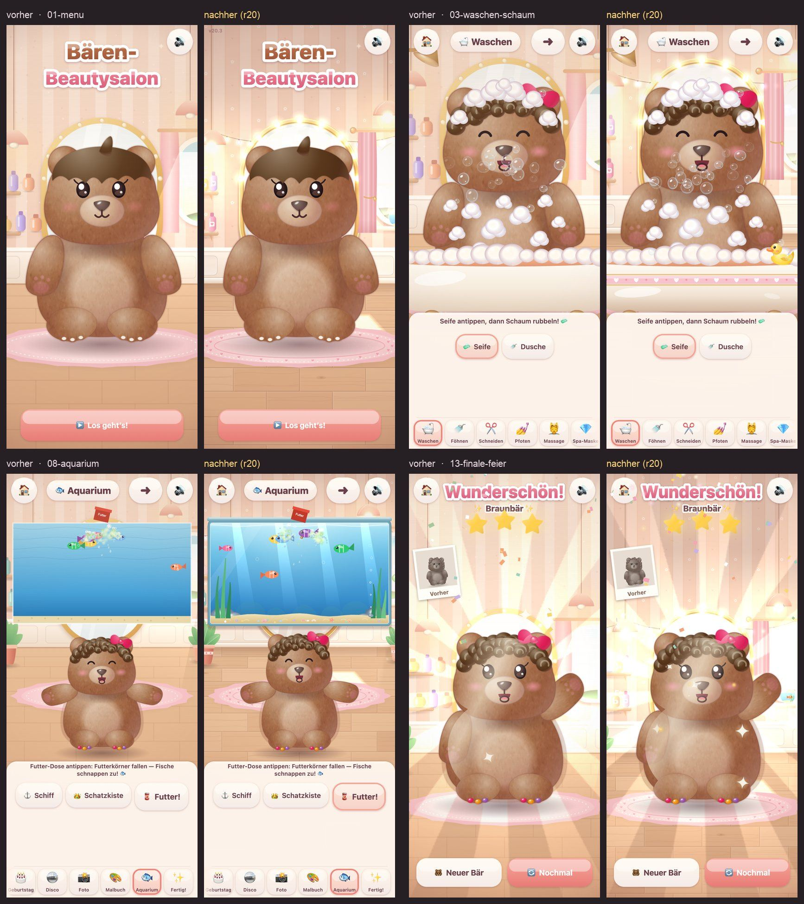
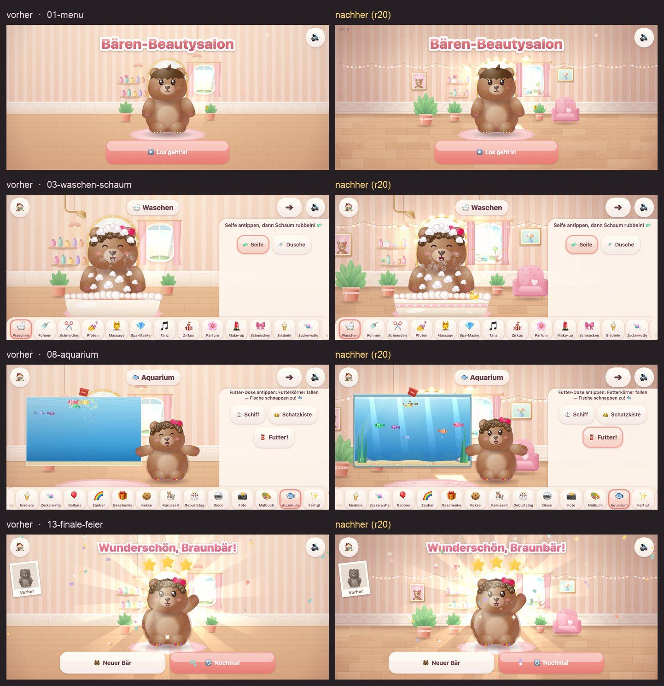

# Deko-Runde (Version 20.3): Bären-Beautysalon, mehr Details und Eye Candy

**Kurz gesagt:** Der Salon sieht jetzt wärmer, voller und lebendiger aus: Lichterkette, Hollywood-Spiegel mit
leuchtenden Lämpchen, Holzboden, Bilder, Sessel, Fischglas, ein richtiges Aquarium, eine Badeente, ein Freu-Hüpfer
und Glitzer im Finale. Trotzdem läuft es **schneller als vorher**. In allen gemessenen Szenen sinkt die Bildzeit, weil
eine teure Vollbild-Ebene jetzt nur noch einmal vorbereitet wird. Die Spielmechanik ist unverändert.

- **Neu:** https://drpeterkalmar.github.io/baeren-beautysalon/
- **Alt zum Vergleich (A/B):** https://drpeterkalmar.github.io/baeren-beautysalon/?deko=0
- Im Menü steht oben links klein die Version: `v20.3` (bei `?deko=0` steht dort `v20.3 · alte Optik`).
- Am Handy die Seite **einmal neu laden**, bei Android-Chrome notfalls den Tab schließen und neu öffnen.

## Was vorher leer oder flach wirkte (Ist-Rundgang)
- Die Wände waren eine blasse, einheitliche Pfirsich-Fläche. Im Querformat und im Menü sah man viel leere Wand und leeren Boden.
- Der Spiegel war weiß-grau, die Lämpchen am Spiegelrand leuchteten nicht.
- Der Boden bestand nur aus Linien, ohne Holzgefühl.
- Das Aquarium war ein flaches blaues Rechteck mit Sandstreifen.
- Die Badewanne hatte eine große, leere cremefarbene Front.
- Nichts im Hintergrund bewegte sich, und Erfolge waren nur mit dem Konfetti im Finale zu sehen.

## Was ist neu (in der Reihenfolge Wirkung pro Kosten)
1. **Warmes Salon-Licht:** Die Hängelampen werfen weiche Lichtkegel, durch das Fenster fällt ein Sonnenstrahl mit
   Sonnenfleck auf dem Boden. Decke und Raumecken sind etwas dunkler, unter der Fußleiste liegt ein weicher Schatten.
2. **Holzboden** mit Dielen, Maserung, Astlöchern und Farbunterschieden. Der **Teppich** hat jetzt einen Herzchen-Ring.
3. **Hollywood-Spiegel:** Der Spiegel hat einen goldenen Rahmen mit Kanten und Spiegelungen, und die neun Lämpchen
   leuchten warm und funkeln sanft.
4. **Mehr Einrichtung:** Eine Lichterkette mit bunten Glühbirnchen zieht sich über die Wand. Dazu kommen Regale mit
   Fläschchen (mit Herz-Etikett), Wattetiegel, Handtuchrollen, Herzseife und Kaktus, ein Bären-Porträt und ein
   Blumenbild, ein rosa Sessel mit Herzkissen, eine große Pflanze und die Fensterbank mit **Fischglas** und Blumentopf.
5. **Sanft bewegter Hintergrund:** Die Vorhänge schwingen leicht, Wolken ziehen am Fenster vorbei, im Fischglas schwimmt
   ein Goldfisch und die Lämpchen funkeln.
6. **Aquarium:** Das Becken hat jetzt Tiefe und Lichtstrahlen, Korallen im Hintergrund, Steine und Sand mit bunten
   Steinchen, Muscheln und einem Seestern. Wasserpflanzen wiegen sich, ein Sprudelstein macht eine Blasensäule, die
   Wasseroberfläche bewegt sich, und es gibt Rahmen und Deckel. Fische und Futter bleiben voll sichtbar (siehe unten).
7. **Waschen:** Die Wanne hat ein rosa Band mit Herzchen und Goldkanten. Eine **Badeente** schaukelt auf dem Rand
   (beim Duschen stärker), und aus dem Schaum steigen Seifenblasen auf.
8. **Freu-Hüpfer:** Wenn sich der Bär freut, hüpft er höher, streckt sich im Flug, staucht bei der Landung und federt
   nach. An den Füßen funkelt es. Beim Betreten jeder Station hüpft er einmal vor Freude.
9. **Glitzer beim Finale:** Beim TA-DA gibt es einen goldenen Funkel-Kranz. Danach kreisen Sterne um den Bären
   (vorne hell, hinten blasser, wie in 3D), auf dem Fell glitzert es golden und von oben rieselt sanfter Glitzer. Auf der
   Station „Fertig!“ funkelt es schon leise vor dem großen Auftritt.
10. **Übergänge:** Beim Stationswechsel zieht ein funkelnder Schwung schräg über die Spielfläche (zusätzlich zur
    bisherigen Überblendung).

Unverändert: Spielmechanik, Knöpfe, Touch-Zonen, Speicherstand, alle Stationen, die Kinderwünsche aus R18/R19
(Aquarium mit Bär daneben bzw. darunter, Jonglierbälle in den Pfoten), Musik. Deko liegt nie hinter Knöpfen oder auf Text.

## Messung vorher/nachher
Aufbau: Handy-Größe 412×915 bei doppelter Pixeldichte (Hochformat), Prozessor per Chrome-Werkzeug **4× gedrosselt**
(Mittelklasse-Handy), je Szene **10,5 s**. Szenen: Menü, Waschen (Seife, Rubbeln, Dusche im Wechsel), Aquarium
(Füttern alle 1,4 s), Finale (Enthüllung + Feier). Alt und neu wurden abwechselnd gemessen, jeweils zwei Läufe gemittelt.
„Software-Raster“ heißt: ohne Grafikchip. Das ist der strengste Fall, weil dort jedes Pixel den Prozessor kostet.
Die Erstmessung vor jeder Änderung lag innerhalb von ±3 % der Kontrollmessung des alten Stands.

**Höchste Qualitätsstufe (2), Software-Raster, 4× gedrosselt** (Budget: p95 höchstens +10 %)

| Szene | vorher p50 | vorher p95 | nachher p50 | nachher p95 | Δ p95 |
|---|---|---|---|---|---|
| Menü | 54,6 ms | 76,2 ms | 44,0 ms | 60,5 ms | **−21 %** |
| Waschen | 74,0 ms | 93,5 ms | 62,6 ms | 81,9 ms | **−12 %** |
| Aquarium | 49,5 ms | 66,5 ms | 34,9 ms | 55,5 ms | **−17 %** |
| Finale | 100,7 ms | 153,9 ms | 86,9 ms | 141,9 ms | **−8 %** |

**Niedrigste Qualitätsstufe (0)** (Budget: gleich oder besser)

| Szene | vorher p50 | vorher p95 | nachher p50 | nachher p95 | Δ p95 |
|---|---|---|---|---|---|
| Menü | 27,0 ms | 42,0 ms | 15,1 ms | 35,8 ms | **−15 %** |
| Waschen | 34,1 ms | 52,4 ms | 30,8 ms | 44,0 ms | **−16 %** |
| Aquarium | 26,8 ms | 40,2 ms | 14,4 ms | 35,1 ms | **−13 %** |
| Finale | 33,6 ms | 55,2 ms | 29,0 ms | 49,9 ms | **−10 %** |

**Auto-Drosselung aktiv** (Stufe wählt sich selbst, landet wie vorher auf 0): p95 Menü 53,4 → 43,9 ms (−18 %),
Waschen 53,3 → 49,4 ms (−7 %), Aquarium 39,4 → 35,3 ms (−10 %), Finale 54,0 → 48,1 ms (−11 %).

**Realistisch mit Grafikchip (GPU), 4× gedrosselt, Bildsynchronisation an, Stufe 2:** Die Bildzeit ist unverändert
(p50 ≈ 11–15 ms, p95 ≈ 21–27 ms, vorher wie nachher). Die Rechenzeit pro Bild (p95) ist praktisch gleich:
Menü 0,3 → 0,4 ms, Waschen 2,6 → 2,7 ms, Aquarium 2,5 → 2,5 ms, Finale 4,3 → 4,3 ms.

**Ruckler beim Stationswechsel** (längstes Bild nach einem Wechsel, Mittel über 7 Wechsel). Der Raum wird nach der
Kamerafahrt neu vorbereitet. Das passiert jetzt in kleinen Portionen *während* der Fahrt:

| Fall | vorher Mittel / Spitze | nachher Mittel / Spitze |
|---|---|---|
| Software-Raster, Stufe 0 | 59 / 76 ms | **54 / 66 ms** |
| Software-Raster, Stufe 2 | 107 / 135 ms | **97 / 105 ms** |
| GPU, Stufe 2 | 27,5 / 28 ms | 28 / 29 ms (gleich) |

**Ladegröße** (alles, was das Spiel lädt, gzip): **289 KB → 309 KB (+19 KB)**, Budget wäre +1 MB.
Es gibt keine neuen externen Anfragen und keine Fremd-Assets. Alles ist prozedural gezeichnet, deshalb braucht es keine LICENSES.md.

**Kontrollen:** `?deko=0` auf dem neuen Code misst wie der alte Stand (p95 73,8 / 94,5 / 65,9 / 148,3 ms gegenüber
76,2 / 93,5 / 66,5 / 153,9 ms). Auch die Bilder entsprechen dem alten Stand: Die Pixel-Abweichung ist so klein wie zwischen
zwei Läufen des alten Stands. Mit „Bewegung reduzieren“ ist es noch etwas schneller (p95 59 / 78 / 51 / 128 ms).

**Warum es trotz mehr Details schneller ist:** Der warme Farbfilter (Vignette) wurde bisher in *jedem* Bild als
Vollbild-Ebene über alles gelegt. Jetzt steckt er einmal im vorbereiteten Raumbild. Alles Statische (Möbel, Boden,
Licht, Lichterkette) wird einmal gezeichnet. Pro Bild kommen nur wenige kleine Bildchen dazu (Vorhänge, Wolken,
Fisch, Funkeln), und das nur auf Qualitätsstufe 1 und 2.

## Vergleichsbilder (vorher links, nachher rechts)
- Hochformat: Menü, Waschen, Aquarium, Finale: `tests/shots/deko/vergleich_hoch.jpg`
- Hochformat: Wanne mit Ente, Zirkus, TA-DA, Bärenwahl: `tests/shots/deko/vergleich_hoch_2.jpg`
- Querformat: Menü, Waschen, Aquarium, Finale: `tests/shots/deko/vergleich_quer.jpg`
- Querformat: Föhnen, Zirkus, Disco, TA-DA: `tests/shots/deko/vergleich_quer_2.jpg`

**Ehrliche Bewertung:**
- **Querformat und Menü:** Hier ist der Unterschied am größten. Der Raum ist nicht mehr leer, sondern ein gemütlicher Salon.
- **Aquarium:** Das ist in beiden Ausrichtungen der größte Sprung.
- **Hochformat:** Der Bär füllt fast das ganze Bild. Man sieht vor allem die leuchtenden Spiegel-Lämpchen, die
  Lichterkette am Rand, die verzierte Wanne mit der Ente, den Herzchen-Teppich und das Aquarium. Der Unterschied ist
  deutlich, aber kleiner als quer.
- **Finale:** Auf Standbildern wirkt es fast wie vorher, weil der Strahlenkranz dominiert. Das neue Glitzern und die
  kreisenden Sterne sieht man erst in Bewegung.
- Hüpfer, Übergänge, Vorhänge, Wolken und Fisch sind ebenfalls Bewegungseffekte. Sie zeigen sich im Spiel, nicht im Screenshot.

## Ressourcen-Regeln
- Es gibt keinen zusätzlichen Render-Loop. Alles läuft im vorhandenen Bild-Takt. Ist der Tab versteckt, pausiert der
  Browser diesen Takt und damit alle Effekte (die Musik pausiert wie bisher).
- Effekte hängen an der vorhandenen Qualitätsstufe und an der Auto-Drosselung. Auf **Stufe 0** ist alles nur statisch
  (kein Funkeln, keine Wolken, Vorhänge still, Raum schlanker gezeichnet). Auf **Stufe 1** gibt es weniger Funkeln.
- **„Bewegung reduzieren“** (Handy-Einstellung) wird beachtet: kein Hüpfen, kein Wackeln der Kamera beim TA-DA, kein
  Glitzerregen, keine schwingenden Vorhänge, weniger Partikel.
- Partikel kommen aus dem vorhandenen Partikel-Pool (Obergrenze je Stufe).

## Worauf du am Handy achten kannst
1. Steht im Menü oben links `v20.3`? Falls nicht, einmal neu laden.
2. Fühlt sich das Spiel genauso flüssig an wie vorher, vor allem beim Wechsel der Stationen (Kamerafahrt) und im
   Finale? Laut Messung sollte es eher flüssiger sein.
3. Einmal ins **Querformat** drehen, dort sieht man den ganzen neuen Salon.
4. Waschen: Schaukelt die Ente? Steigen Seifenblasen auf? Aquarium: Wiegen sich die Pflanzen, sind alle Fische gut zu sehen?
5. Finale: Kreisen die Funkel-Sterne um den Bären?
6. A/B: dieselbe Station einmal mit dem Link `?deko=0` ansehen.
7. Nach ein paar Minuten Spielen: Wird das Handy wärmer als vorher? Laut Messung sollte es eher weniger rechnen.

## Tests
- Kompletter Durchlauf (alle 24 Stationen per Tippen + Finale, `tools/visual-check.mjs`) im Hoch- und Querformat:
  **0 Fehler, 0 Knöpfe unter 48 px**, nach jeder Etappe.
- Alle 24 Stationen einzeln im Hoch- und Querformat fotografiert und angesehen: überall stimmig.
- R19-Prüfung: Das Aquarium wird vom Bären **zu 0 % verdeckt** (hoch und quer), die Jonglierbälle berühren sich nie
  (Mindestabstand 55), die Pfoten liegen weiter bei y≈425.
- Live-Check nach jeder Etappe gegen GitHub Pages: HTTP 200, Version stimmt, 0 Fehler, keine fehlerhaften Anfragen
  (auch mit `?deko=0` und im Querformat).
  Hinweis: Der Test-Browser bricht den Musik-Download manchmal ab, weil er kein AAC abspielen kann. Live liefert die Datei HTTP 200.
- Serienbilder von Stationswechsel und Finale sowie Screenshots mit „Bewegung reduzieren“: 0 Fehler.

## Etappen (alle sofort committet, gepusht und live geprüft)
| Version | Inhalt |
|---|---|
| 20.1 | Licht, Holzboden, Spiegel-Lämpchen, Lichterkette, Einrichtung, bewegter Hintergrund, Farbfilter eingebacken |
| 20.2 | Badewanne mit Ente und Seifenblasen, Aquarium |
| 20.3 | Freu-Hüpfer, Glitzer im Finale, Übergänge, Raum in Portionen backen (keine Ruckler), „Bewegung reduzieren“ |

## Technik (für später)
- Neues Modul `deko.js` (nach room.js geladen). Schalter `Fx.DEKO` in fx.js, bei `?deko=0` aus; dann laufen alle
  alten Pfade unverändert.
- Geänderte Dateien: fx.js (Schalter, Grading-Funktion), game.js (Raum-Cache in Portionen, Grading eingebacken,
  Update-Haken), salon.js (Haken für Wanne, Aquarium, Finale), art.js (Freu-Hüpfer), ui.js (Versions-Label), index.html.
- Mess- und Prüfwerkzeuge in `tests/`: `deko-check.mjs` (Screenshots + Leistung, `--src=` für den alten Stand),
  `hitch-check.mjs`, `live-check.mjs`, `ladegroesse.py`, `collage.py`, `perf-tabelle.py`. Den alten Stand für Messungen
  holst du mit: `git archive 283f890 | tar -x -C shots/vorher-src`.
- Einzelheiten stehen in ARCHITECTURE.md (Abschnitt r20) und CHECKS.md (R20).

## Grenzen
- Die Zahlen stammen aus Headless-Chrome auf dem Mac mini mit 4-fach gedrosseltem Prozessor. Echte Handys können
  abweichen, die Richtung (nicht langsamer) ist aber in allen Messarten gleich.
- Beim allerersten Betreten einer Station werden einmalig ein paar Bildchen vorbereitet (z. B. Wanne und Ente). Das
  kostet einmalig etwa 20 ms mehr (gemessen mit GPU), danach nichts mehr.
